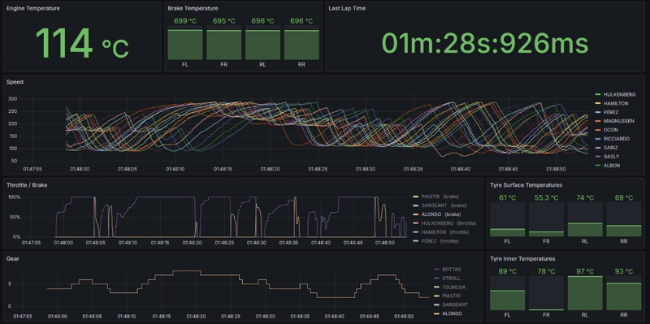

# F1 24 Telemetry Dashboard

## Overview

This project provides a professional-grade, real-time telemetry analysis platform for the **F1 24** game, orchestrated entirely with Docker. It captures live UDP data from the game, processes it with a custom Python parser, stores it in InfluxDB, and visualizes it on a pre-configured Grafana dashboard.



This tool is designed for serious racers who want to use data-driven insights to refine their race craft, optimize lap times, and gain a competitive edge.

### Features
- **Pre-configured Dashboard:** An "F1 Apex Dashboard" is automatically provisioned in Grafana, showing essential metrics like speed, gear, engine/brake temperatures, and throttle/brake inputs.
- **Real-Time Visualization:** All data is updated live, allowing for immediate feedback during a session.
- **Extensible Python Parser:** The parser is modular and can be easily extended to process more of the F1 24 UDP packets.
- **Persistent Data Storage:** InfluxDB stores all session data, enabling post-race analysis and lap comparisons.
- **One-Command Setup:** The entire stack (Parser, Telegraf, InfluxDB, Grafana) is managed with a single `docker-compose` command.
- **Automatic Provisioning:** Grafana is pre-configured with the correct InfluxDB datasource, and the dashboard is loaded on startup.

## Getting Started

### Prerequisites

- [Docker](https://www.docker.com/get-started) and [Docker Compose](https://docs.docker.com/compose/install/)
- A copy of the F1 24 game
- [Git](https://git-scm.com/downloads) for cloning the repository

### Installation & Setup

1.  **Clone the Repository**
    ```bash
    git clone https://github.com/your-username/F1Dashboard.git
    cd F1Dashboard
    ```

2.  **Build and Start the Services**
    Open a terminal in the project root and run:
    ```bash
    docker-compose up -d --build
    ```
    This command builds the custom Telegraf image and starts all services in the background.

3.  **Configure F1 24 Telemetry**
    In the F1 24 game, go to `Settings > Telemetry Settings` and configure it to send data to the IP address of the machine running Docker.
    
    - **UDP IP Address:** Your computer's local network IP address.
        - **Windows:** Open Command Prompt and type `ipconfig`. Look for the "IPv4 Address".
        - **macOS/Linux:** Open a terminal and type `ip a` or `ifconfig`. Look for the `inet` address.
    - **UDP Port:** `20777` (This is the default port in the game, only edit if you know what you are doing).
    - **UDP Send Rate:** `60 Hz` is recommended for smooth data.
    - **UDP Format:** `2024`

4.  **Access Grafana**
    - Open your web browser and navigate to [http://localhost:3000](http://localhost:3000).
    - Log in with the default credentials:
      - **Username:** `admin`
      - **Password:** `admin`
    - You will be prompted to change the password on first login.
    - The **"F1 Apex Dashboard"** will be available in the "Dashboards" section.

## Troubleshooting

- **No Data in Grafana:** If the dashboard shows "No Data", it usually means telemetry isn't reaching InfluxDB. Check the Telegraf logs for errors:
  ```bash
  docker-compose logs telegraf
  ```
  This can be caused by an incorrect IP address in the F1 24 game settings or a firewall blocking UDP port 20777.

- **How to Reset All Data:** If you want to start with a clean slate, you can stop the containers and remove the data volumes. This will delete all stored telemetry and Grafana settings.
  ```bash
  docker-compose down --volumes
  ```
  Then, restart the services with `docker-compose up -d`.

## Project Internals

The project consists of several services working together:

- **Services Overview:**
  - **Python Parser (`f1_24_telemetry_parser.py`):** A script that listens on UDP port 20777, parses the incoming F1 24 data packets, and prints them in the InfluxDB Line Protocol format to standard output.
  - **Telegraf:** A data collection agent that runs the Python parser using the `execd` input plugin. It forwards the output to InfluxDB.
  - **InfluxDB:** A time-series database that stores the telemetry data. The UI is available at `http://localhost:8086`.
  - **Grafana:** A visualization platform that connects to InfluxDB to display the data. The UI is available at `http://localhost:3000`.

- **Directory Structure:**
  - **`docker-compose.yml`**: Orchestrates all the services.
  - **`f1_24_telemetry_parser.py`**: The core Python script for parsing game data.
  - **`packets/`**: Contains Python dataclasses for each F1 24 UDP packet type, making the parser modular and easy to read.
  - **`telegraf/`**: Holds the `telegraf.conf` and a `Dockerfile` to build a custom Telegraf image with Python installed.
  - **`grafana/`**: Contains provisioning files to automatically configure the Grafana data source (`datasource.yml`) and dashboards (`dashboard.yml` and the dashboard JSON). 